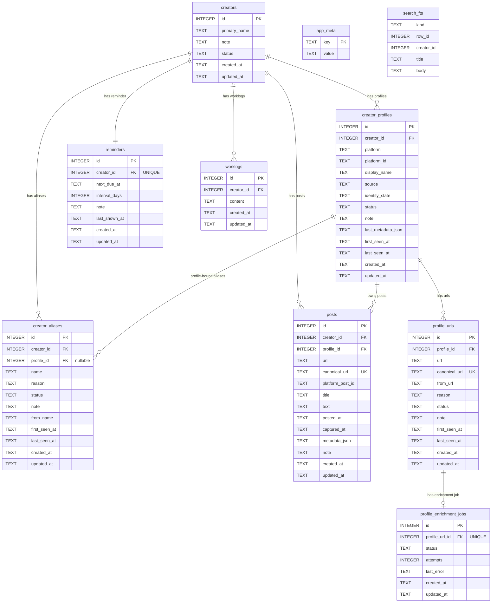

# clog 資料庫 ER 圖報告

本文件描述目前 `clog` 的初始 schema v3。這版已改成 profile-centric identity model：

- `creators` 是穩定主檔
- `creator_profiles` 是外部平台帳號主表
- `profile_urls` 是掛在 profile 下的作者頁 URL
- `creator_aliases` 是名稱歷史；可為 creator-level alias，也可綁定特定 profile
- `posts` 必須綁定既有 profile，不允許只掛 creator

## 頂層資訊

| 項目 | 值 |
|---|---|
| 資料庫類型 | SQLite |
| Schema 版本 | `3` |
| 主要 Schema 來源 | `src/db.py` `ensure_schema()` |
| 連線 PRAGMA | `foreign_keys=ON`、`busy_timeout=5000`、`journal_mode=WAL` |
| ORM | 無；全部使用原生 `sqlite3` |

## ER 圖

## 表說明

### `creators`

創作者主檔。`primary_name` 是穩定主標籤，不代表平台當前顯示名稱。

### `creator_profiles`

系統已知的作者平台帳號主表。

- `platform + platform_id` 是唯一外部身份
- `identity_state` 為 `resolved | unresolved`
- unresolved profile 允許只有平台或只有 URL 線索，尚未解析出平台帳號 ID

### `profile_urls`

作者頁 URL 歷史，只能掛在 profile 下。

- `canonical_url` 全域唯一
- `add url` 只會建立或更新這張表，不讓 URL 直接掛在 creator

### `creator_aliases`

名稱歷史。

- `profile_id IS NULL`：generic alias，屬於 creator-level 名稱
- `profile_id IS NOT NULL`：某個 profile 的平台名稱歷史

### `posts`

貼文紀錄。

- `profile_id` 為 `NOT NULL`
- 每篇 post 必須對應既有 profile
- `add post` 不補建 profile / profile_url / alias

### `profile_enrichment_jobs`

背景 metadata 補全任務。

- 每個 `profile_url` 最多一個 job
- 只負責把 unresolved 或資訊不完整的 profile 補成 resolved
- `status` 使用 `pending | done | error | conflict`

### `search_fts`

FTS5 全文搜尋索引，由應用層增量維護。索引來源包含：

- creator
- alias
- profile
- profile_url
- post
- reminder
- work

### `worklogs`

creator-level 工作紀錄。

- 只綁 `creator_id`
- 只保存 `content`
- `content` 是 raw markdown source，目前先以純文字顯示
- 不再保存 tags / paths / urls / metadata JSON

## 主要關聯

| 主表 | 子表 | 關係 | 說明 |
|---|---|---|---|
| `creators` | `creator_profiles` | 1:N | 一位 creator 可有多個平台帳號 |
| `creators` | `creator_aliases` | 1:N | 一位 creator 可有多個名稱歷史 |
| `creator_profiles` | `profile_urls` | 1:N | 一個 profile 可有多個作者頁 URL |
| `creator_profiles` | `creator_aliases` | 1:N | profile-bound alias |
| `creator_profiles` | `posts` | 1:N | post 永遠屬於既有 profile |
| `creators` | `reminders` | 1:1 | 每位 creator 最多一筆提醒 |
| `creators` | `worklogs` | 1:N | 工作紀錄 |
| `profile_urls` | `profile_enrichment_jobs` | 1:0..1 | 每個 URL 最多一個補全 job |

## 重要約束

| 表 | 約束 |
|---|---|
| `creator_profiles` | `UNIQUE(platform, platform_id)` |
| `profile_urls` | `canonical_url UNIQUE` |
| `posts` | `canonical_url UNIQUE` |
| `reminders` | `creator_id UNIQUE` |
| `profile_enrichment_jobs` | `profile_url_id UNIQUE` |

## 設計備註

1. 平台身份的唯一真相來源是 `creator_profiles`，不是 alias、URL 或 post 欄位。
2. `add name` 可做 generic alias、既有 profile rename、或透過作者頁 URL 建新 profile 後補 alias。
3. `add url` 只接受作者頁 URL；metadata 成功就建立 resolved profile，失敗也至少建立 unresolved profile + profile_url。
4. `add post` 必須命中既有 `(platform, platform_id)` profile；沒有既有 profile 就拒絕。
5. `worklogs` 是單純的人工工作紀錄，不是 metadata 容器。
6. 這版不提供 migration，舊 dev DB 視為不相容，需重新初始化。
