# clog 資料庫 ER 圖報告

本文件整理 `clog` 專案目前資料庫的完整 schema，包含所有資料表的欄位定義、外鍵 (FK)、索引與唯一鍵 (UNIQUE) 約束，並附上一張 ER 圖。

## 頂層資訊

| 項目 | 值 |
|---|---|
| 資料庫類型 | SQLite |
| Schema 版本 | `1` (`src/constants.py:7` `SCHEMA_VERSION`) |
| 主要 Schema 來源 | `src/db.py` 的 `ensure_schema()` (lines 41-194) |
| 連線 PRAGMA | `foreign_keys=ON`、`busy_timeout=5000`、`journal_mode=WAL` (`src/db.py:33-35`) |
| ORM | 無；全部使用原生 `sqlite3` + SQL DDL |

> 全部 FK 關聯皆採用 **`ON DELETE CASCADE`**：刪除 `creators` 主檔時會連帶刪除所有子表紀錄。

---

## ER 圖

```mermaid
erDiagram
    creators ||--o{ creator_names      : "has names"
    creators ||--o{ creator_urls       : "has URLs"
    creators ||--o{ platform_accounts  : "has accounts"
    creators ||--o{ posts              : "has posts"
    creators ||--|| reminders          : "has reminder"
    creators ||--o{ worklogs           : "has worklogs"
    creators ||--o{ metadata_tasks     : "has tasks"

    app_meta {
        TEXT key PK
        TEXT value
    }

    creators {
        INTEGER id PK
        TEXT primary_name
        TEXT note
        TEXT status "default 'active'"
        TEXT created_at
        TEXT updated_at
    }

    creator_names {
        INTEGER id PK
        INTEGER creator_id FK
        TEXT name
        TEXT platform
        TEXT platform_id
        TEXT url
        TEXT canonical_url
        TEXT from_name
        TEXT reason
        TEXT status "default 'active'"
        TEXT note
        TEXT metadata_json
        TEXT first_seen_at
        TEXT last_seen_at
        TEXT created_at
        TEXT updated_at
    }

    creator_urls {
        INTEGER id PK
        INTEGER creator_id FK
        TEXT url
        TEXT canonical_url UK "UNIQUE"
        TEXT platform
        TEXT platform_id
        TEXT name
        TEXT from_url
        TEXT reason
        TEXT status "default 'active'"
        TEXT note
        TEXT metadata_json
        TEXT first_seen_at
        TEXT last_seen_at
        TEXT created_at
        TEXT updated_at
    }

    platform_accounts {
        INTEGER id PK
        INTEGER creator_id FK
        TEXT platform UK "UNIQUE(platform, platform_id)"
        TEXT platform_id UK
        TEXT display_name
        TEXT profile_url
        TEXT profile_canonical_url
        TEXT source
        TEXT metadata_json
        TEXT first_seen_at
        TEXT last_seen_at
        TEXT created_at
        TEXT updated_at
    }

    posts {
        INTEGER id PK
        INTEGER creator_id FK
        TEXT url
        TEXT canonical_url UK "UNIQUE"
        TEXT platform
        TEXT platform_post_id
        TEXT author_platform_id
        TEXT author_name
        TEXT title
        TEXT text
        TEXT posted_at
        TEXT captured_at
        TEXT metadata_json
        TEXT note
        TEXT created_at
        TEXT updated_at
    }

    reminders {
        INTEGER id PK
        INTEGER creator_id FK "UNIQUE (1:1)"
        TEXT next_due_at
        INTEGER interval_days
        TEXT note
        TEXT last_shown_at
        TEXT created_at
        TEXT updated_at
    }

    worklogs {
        INTEGER id PK
        INTEGER creator_id FK
        TEXT message
        TEXT tags_json
        TEXT paths_json
        TEXT urls_json
        TEXT metadata_json
        TEXT created_at
        TEXT updated_at
    }

    metadata_tasks {
        INTEGER id PK
        INTEGER creator_id FK
        TEXT target_kind
        INTEGER target_row_id
        TEXT url
        TEXT canonical_url
        TEXT status "default 'pending'"
        INTEGER attempts "default 0"
        TEXT last_error
        TEXT created_at
        TEXT updated_at
    }

    search_fts {
        TEXT kind "UNINDEXED"
        INTEGER row_id "UNINDEXED"
        INTEGER creator_id "UNINDEXED"
        TEXT title "FTS5 indexed"
        TEXT body "FTS5 indexed"
    }
```

> `app_meta` 與 `search_fts` 不和 `creators` 透過 FK 關聯，故圖中以獨立節點呈現。`search_fts` 為 FTS5 虛擬表，由應用程式邏輯維護同步。

---

## 逐表完整欄位定義

### 1. `app_meta` — 應用程式 metadata
> 來源：`src/db.py:44-47`

| 欄位 | 型別 | 約束 | 說明 |
|---|---|---|---|
| `key` | TEXT | PRIMARY KEY | 設定鍵 |
| `value` | TEXT | NOT NULL | 設定值 |

- **用途**：目前僅儲存 `schema_version`（值 = `1`），由 `ensure_schema()` 結束時 `INSERT OR REPLACE` 寫入 (`src/db.py:190-193`)。
- **索引**：無
- **FK**：無

---

### 2. `creators` — 創作者主檔
> 來源：`src/db.py:49-56`

| 欄位 | 型別 | 約束 | 說明 |
|---|---|---|---|
| `id` | INTEGER | PRIMARY KEY AUTOINCREMENT | 創作者唯一識別碼 |
| `primary_name` | TEXT | NOT NULL | 主要顯示名稱 |
| `note` | TEXT | NULL | 備註 |
| `status` | TEXT | NOT NULL, DEFAULT `'active'` | 狀態 (active / inactive 等) |
| `created_at` | TEXT | NOT NULL | ISO 8601 建立時間 |
| `updated_at` | TEXT | NOT NULL | ISO 8601 更新時間 |

- **索引**：無（除主鍵外）
- **FK**：無（為主表，被其他表參照）

---

### 3. `creator_names` — 創作者曾用名歷史
> 來源：`src/db.py:58-75`

| 欄位 | 型別 | 約束 | 說明 |
|---|---|---|---|
| `id` | INTEGER | PRIMARY KEY AUTOINCREMENT | 列識別碼 |
| `creator_id` | INTEGER | NOT NULL, **FK → `creators(id)` ON DELETE CASCADE** | 所屬創作者 |
| `name` | TEXT | NOT NULL | 名稱 |
| `platform` | TEXT | NULL | 平台代號（如 `twitter`、`pixiv`） |
| `platform_id` | TEXT | NULL | 平台識別碼 |
| `url` | TEXT | NULL | 來源 URL |
| `canonical_url` | TEXT | NULL | 標準化 URL |
| `from_name` | TEXT | NULL | 改名前的舊名 |
| `reason` | TEXT | NULL | 改名原因 |
| `status` | TEXT | NOT NULL, DEFAULT `'active'` | 狀態 |
| `note` | TEXT | NULL | 備註 |
| `metadata_json` | TEXT | NULL | JSON 格式 metadata |
| `first_seen_at` | TEXT | NOT NULL | ISO 8601 首次出現時間 |
| `last_seen_at` | TEXT | NOT NULL | ISO 8601 最近一次出現時間 |
| `created_at` | TEXT | NOT NULL | 建立時間 |
| `updated_at` | TEXT | NOT NULL | 更新時間 |

- **索引**：
  - `idx_creator_names_creator` on `(creator_id)` (`src/db.py:169`)
  - `idx_creator_names_name` on `(name)` (`src/db.py:170`)

---

### 4. `creator_urls` — 創作者 URL 歷史
> 來源：`src/db.py:77-94`

| 欄位 | 型別 | 約束 | 說明 |
|---|---|---|---|
| `id` | INTEGER | PRIMARY KEY AUTOINCREMENT | 列識別碼 |
| `creator_id` | INTEGER | NOT NULL, **FK → `creators(id)` ON DELETE CASCADE** | 所屬創作者 |
| `url` | TEXT | NOT NULL | 完整 URL |
| `canonical_url` | TEXT | NOT NULL **UNIQUE** | 標準化 URL（全表唯一） |
| `platform` | TEXT | NULL | 推斷出的平台 |
| `platform_id` | TEXT | NULL | 平台識別碼 |
| `name` | TEXT | NULL | 該 URL 對應的名稱 |
| `from_url` | TEXT | NULL | 變更前的舊 URL |
| `reason` | TEXT | NULL | 變更原因 |
| `status` | TEXT | NOT NULL, DEFAULT `'active'` | 狀態 |
| `note` | TEXT | NULL | 備註 |
| `metadata_json` | TEXT | NULL | JSON 格式 metadata |
| `first_seen_at` | TEXT | NOT NULL | 首次出現時間 |
| `last_seen_at` | TEXT | NOT NULL | 最近一次出現時間 |
| `created_at` | TEXT | NOT NULL | 建立時間 |
| `updated_at` | TEXT | NOT NULL | 更新時間 |

- **索引**：
  - `idx_creator_urls_creator` on `(creator_id)` (`src/db.py:171`)
  - `idx_creator_urls_status` on `(status)` (`src/db.py:172`)

---

### 5. `platform_accounts` — 平台帳號對應
> 來源：`src/db.py:96-111`

| 欄位 | 型別 | 約束 | 說明 |
|---|---|---|---|
| `id` | INTEGER | PRIMARY KEY AUTOINCREMENT | 列識別碼 |
| `creator_id` | INTEGER | NOT NULL, **FK → `creators(id)` ON DELETE CASCADE** | 所屬創作者 |
| `platform` | TEXT | NOT NULL | 平台代號 |
| `platform_id` | TEXT | NOT NULL | 平台帳號識別碼 |
| `display_name` | TEXT | NULL | 平台顯示名稱 |
| `profile_url` | TEXT | NULL | 完整個人頁 URL |
| `profile_canonical_url` | TEXT | NULL | 標準化個人頁 URL |
| `source` | TEXT | NULL | 此紀錄的來源 |
| `metadata_json` | TEXT | NULL | JSON 格式 metadata |
| `first_seen_at` | TEXT | NOT NULL | 首次出現時間 |
| `last_seen_at` | TEXT | NOT NULL | 最近一次出現時間 |
| `created_at` | TEXT | NOT NULL | 建立時間 |
| `updated_at` | TEXT | NOT NULL | 更新時間 |

- **複合 UNIQUE**：`UNIQUE(platform, platform_id)`（同一個平台的同一個帳號 ID 不可重複出現）
- **索引**：
  - `idx_platform_accounts_creator` on `(creator_id)` (`src/db.py:173`)
  - `idx_platform_accounts_profile` on `(profile_canonical_url)` (`src/db.py:174`)

---

### 6. `posts` — 貼文 / 作品紀錄
> 來源：`src/db.py:113-130`

| 欄位 | 型別 | 約束 | 說明 |
|---|---|---|---|
| `id` | INTEGER | PRIMARY KEY AUTOINCREMENT | 貼文識別碼 |
| `creator_id` | INTEGER | NOT NULL, **FK → `creators(id)` ON DELETE CASCADE** | 所屬創作者 |
| `url` | TEXT | NOT NULL | 貼文 URL |
| `canonical_url` | TEXT | NOT NULL **UNIQUE** | 標準化 URL（全表唯一） |
| `platform` | TEXT | NULL | 內容平台 |
| `platform_post_id` | TEXT | NULL | 平台貼文 ID |
| `author_platform_id` | TEXT | NULL | 平台作者 ID |
| `author_name` | TEXT | NULL | 平台顯示作者名 |
| `title` | TEXT | NULL | 貼文標題 |
| `text` | TEXT | NULL | 貼文內文 |
| `posted_at` | TEXT | NULL | ISO 8601 發文時間 |
| `captured_at` | TEXT | NOT NULL | ISO 8601 抓取時間 |
| `metadata_json` | TEXT | NULL | 平台原始 metadata（JSON） |
| `note` | TEXT | NULL | 使用者備註 |
| `created_at` | TEXT | NOT NULL | 建立時間 |
| `updated_at` | TEXT | NOT NULL | 更新時間 |

- **索引**：
  - `idx_posts_creator` on `(creator_id)` (`src/db.py:175`)

---

### 7. `reminders` — 創作者提醒（1:1）
> 來源：`src/db.py:132-141`

| 欄位 | 型別 | 約束 | 說明 |
|---|---|---|---|
| `id` | INTEGER | PRIMARY KEY AUTOINCREMENT | 提醒識別碼 |
| `creator_id` | INTEGER | NOT NULL **UNIQUE**, **FK → `creators(id)` ON DELETE CASCADE** | 每位創作者最多一筆提醒 |
| `next_due_at` | TEXT | NOT NULL | ISO 8601 下次提醒時間 |
| `interval_days` | INTEGER | NULL | 間隔天數（重複提醒用） |
| `note` | TEXT | NULL | 提醒備註 |
| `last_shown_at` | TEXT | NULL | 最近一次顯示時間 |
| `created_at` | TEXT | NOT NULL | 建立時間 |
| `updated_at` | TEXT | NOT NULL | 更新時間 |

- **索引**：
  - `idx_reminders_due` on `(next_due_at)` (`src/db.py:176`)

> `creator_id` 上的 `UNIQUE` 即構成 `creators ↔ reminders` 的 1:1 關係。

---

### 8. `worklogs` — 工作日誌
> 來源：`src/db.py:143-153`

| 欄位 | 型別 | 約束 | 說明 |
|---|---|---|---|
| `id` | INTEGER | PRIMARY KEY AUTOINCREMENT | 日誌識別碼 |
| `creator_id` | INTEGER | NOT NULL, **FK → `creators(id)` ON DELETE CASCADE** | 所屬創作者 |
| `message` | TEXT | NOT NULL | 工作描述 |
| `tags_json` | TEXT | NULL | 標籤陣列（JSON） |
| `paths_json` | TEXT | NULL | 檔案路徑陣列（JSON） |
| `urls_json` | TEXT | NULL | URL 陣列（JSON） |
| `metadata_json` | TEXT | NULL | 額外 metadata（JSON） |
| `created_at` | TEXT | NOT NULL | 建立時間 |
| `updated_at` | TEXT | NOT NULL | 更新時間 |

- **索引**：
  - `idx_worklogs_creator` on `(creator_id)` (`src/db.py:177`)

---

### 9. `metadata_tasks` — 背景 metadata 抓取佇列
> 來源：`src/db.py:155-167`

| 欄位 | 型別 | 約束 | 說明 |
|---|---|---|---|
| `id` | INTEGER | PRIMARY KEY AUTOINCREMENT | 任務識別碼 |
| `creator_id` | INTEGER | NOT NULL, **FK → `creators(id)` ON DELETE CASCADE** | 所屬創作者 |
| `target_kind` | TEXT | NOT NULL | 對應的目標表類型（如 `url`、`name`） |
| `target_row_id` | INTEGER | NOT NULL | 目標表的列 ID（**邏輯 FK，非 DB 強制**） |
| `url` | TEXT | NOT NULL | 要抓取 metadata 的 URL |
| `canonical_url` | TEXT | NOT NULL | 標準化 URL |
| `status` | TEXT | NOT NULL, DEFAULT `'pending'` | 任務狀態（pending / done / failed 等） |
| `attempts` | INTEGER | NOT NULL, DEFAULT `0` | 已嘗試次數 |
| `last_error` | TEXT | NULL | 最近一次錯誤訊息 |
| `created_at` | TEXT | NOT NULL | 建立時間 |
| `updated_at` | TEXT | NOT NULL | 更新時間 |

- **索引**：
  - `idx_metadata_tasks_status` on `(status, attempts)` (`src/db.py:178`)（找出待處理任務並依嘗試次數排序）

> `target_row_id` 為應用層維護的「邏輯外鍵」，依 `target_kind` 指向 `creator_names` / `creator_urls` 等不同表，DB 層級不強制完整性。

---

### 10. `search_fts` — FTS5 全文搜尋虛擬表
> 來源：`src/db.py:180-187`

| 欄位 | 索引狀態 | 說明 |
|---|---|---|
| `kind` | UNINDEXED | 紀錄類型（creator / name / url / account / post / reminder / work 等） |
| `row_id` | UNINDEXED | 對應原表的列 ID |
| `creator_id` | UNINDEXED | 用於依創作者過濾的篩選欄位 |
| `title` | FTS5 indexed | 主搜尋文字 |
| `body` | FTS5 indexed | 次搜尋文字 |

- **類型**：FTS5 虛擬表
- **Tokenizer**：`unicode61`
- **用途**：跨所有實體的全文檢索；由應用層手動同步

---

## 關聯總覽

| 主表 | 子表 | 關係 | FK 行為 |
|---|---|---|---|
| `creators` | `creator_names` | 1:N | `ON DELETE CASCADE` |
| `creators` | `creator_urls` | 1:N | `ON DELETE CASCADE` |
| `creators` | `platform_accounts` | 1:N | `ON DELETE CASCADE` |
| `creators` | `posts` | 1:N | `ON DELETE CASCADE` |
| `creators` | `reminders` | **1:1**（`creator_id` UNIQUE） | `ON DELETE CASCADE` |
| `creators` | `worklogs` | 1:N | `ON DELETE CASCADE` |
| `creators` | `metadata_tasks` | 1:N | `ON DELETE CASCADE` |

> `app_meta` 與 `search_fts` 為獨立資料表，與其他表無 FK 連結。

---

## 索引總覽

| 表 | 索引名稱 | 欄位 | 用途 |
|---|---|---|---|
| `creator_names` | `idx_creator_names_creator` | `(creator_id)` | 依創作者查詢 |
| `creator_names` | `idx_creator_names_name` | `(name)` | 依名稱查詢 |
| `creator_urls` | `idx_creator_urls_creator` | `(creator_id)` | 依創作者查詢 |
| `creator_urls` | `idx_creator_urls_status` | `(status)` | 依狀態過濾 |
| `platform_accounts` | `idx_platform_accounts_creator` | `(creator_id)` | 依創作者查詢 |
| `platform_accounts` | `idx_platform_accounts_profile` | `(profile_canonical_url)` | 由 URL 反查帳號 |
| `posts` | `idx_posts_creator` | `(creator_id)` | 依創作者查詢 |
| `reminders` | `idx_reminders_due` | `(next_due_at)` | 找出到期提醒 |
| `worklogs` | `idx_worklogs_creator` | `(creator_id)` | 依創作者查詢 |
| `metadata_tasks` | `idx_metadata_tasks_status` | `(status, attempts)` | 取出待處理任務 |

---

## Unique constraints 總覽

| 表 | 欄位 | 類型 |
|---|---|---|
| `app_meta` | `key` | PRIMARY KEY |
| `creators` | `id` | PRIMARY KEY |
| `creator_names` | `id` | PRIMARY KEY |
| `creator_urls` | `id` | PRIMARY KEY |
| `creator_urls` | `canonical_url` | UNIQUE |
| `platform_accounts` | `id` | PRIMARY KEY |
| `platform_accounts` | `(platform, platform_id)` | 複合 UNIQUE |
| `posts` | `id` | PRIMARY KEY |
| `posts` | `canonical_url` | UNIQUE |
| `reminders` | `id` | PRIMARY KEY |
| `reminders` | `creator_id` | UNIQUE（構成 1:1） |
| `worklogs` | `id` | PRIMARY KEY |
| `metadata_tasks` | `id` | PRIMARY KEY |

---

## 設計備註

1. **歷史式（fact-based）保存**：`creator_names`、`creator_urls`、`platform_accounts` 都允許每位創作者有多筆紀錄，用以追蹤改名、搬遷、跨平台帳號變動歷史，而非以單一欄位代表現況。
2. **JSON 欄位**：所有 `*_json` 欄位（`metadata_json`、`tags_json`、`paths_json`、`urls_json`）以字串存放 JSON，提供彈性 metadata 擴充而不需 schema migration。
3. **Canonical URL 去重**：`creator_urls.canonical_url` 與 `posts.canonical_url` 設為 UNIQUE，保證跨整個系統 URL 不會重複登錄。
4. **FTS5 為外部維護**：`search_fts` 不透過觸發器與其他表自動同步，需由應用層在 insert/update 時主動寫入，並以 `kind` + `row_id` + `creator_id` 對應回原表。
5. **級聯刪除**：刪除 `creators` 任何一列會自動清掉所有子表（包含 `reminders`、`metadata_tasks`、`posts` 等）相關紀錄。
6. **`metadata_tasks.target_row_id` 是邏輯 FK**：實際指向哪張表由 `target_kind` 決定，DB 不強制完整性，需應用層保證一致。
